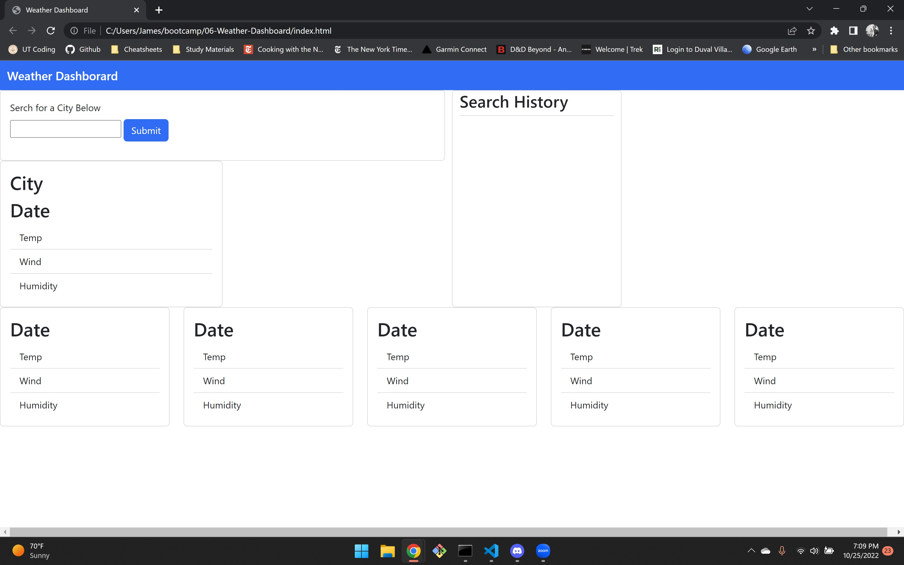

# 06-weather-dashboard
This is the sixth challange assignment for the UTA Full Stack Coding Bootcamp. The unique acceptance criteria for this challenge was to create a simple weather application that displays the current weather for a user selected city as well as the next five days. The acceptance criteria is as follows:
1. Current and future weather displayed for selected city
2. City name, date, weather icon, temp, wind, and humidity are displayed for current day and next five days.
3. Search history calls same data

## Access
-The deployed page can be accessed via: https://carterjamesmike.github.io/06-Weather-Dashboard/
-The code can be accessed via: https://github.com/carterjamesmike/06-Weather-Dashboard

## Screenshot of applicaiton

## Credits
N/A